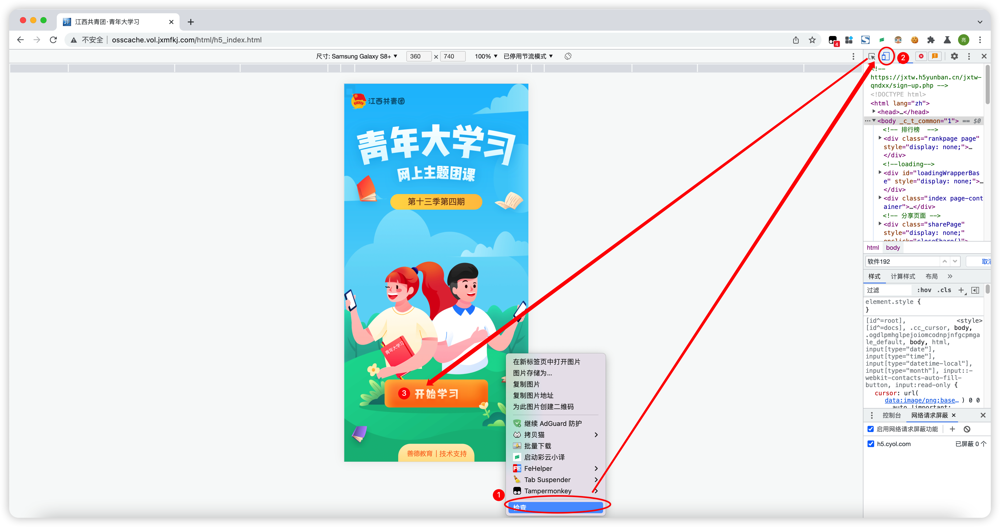
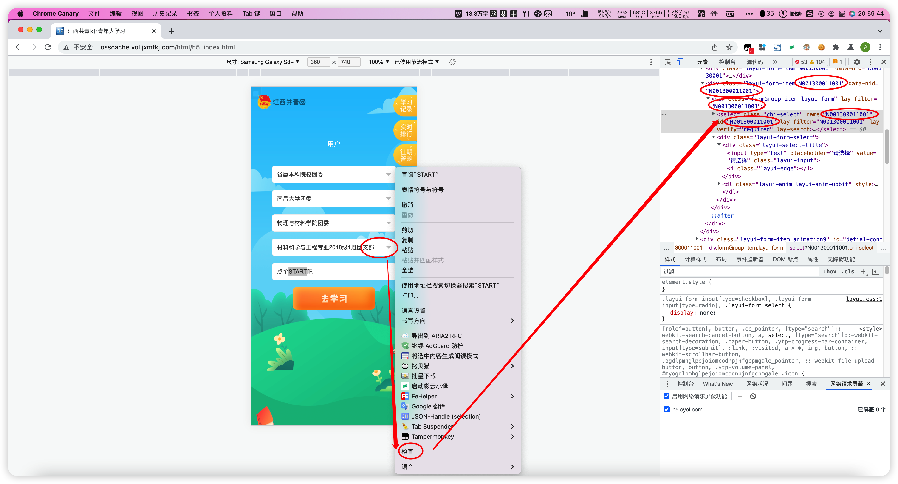
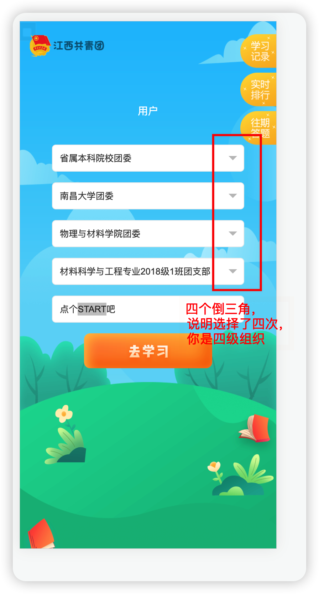
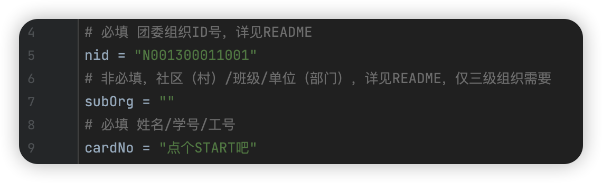
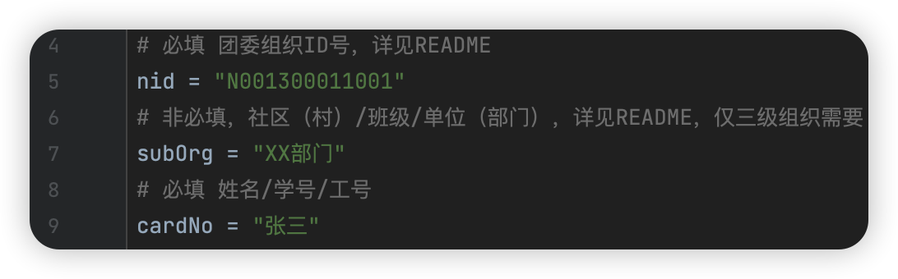

# JiangxiYouthStudyMaker

江西省2022新版青年大学习善德教育系统自动大学习，支持GitHubAction、云函数自动签到

## （新版本正在构建当中，目前个人提交版本已可用）

## 运行环境

Python版本需要大于3.6

## 手动运行指南

1. 将整个项目 Fork到自己仓库/拉取到本地/下载到本地

2. pip3 install -r requirements.txt 安装依赖

3. 打开main.py，修改第6-14行的数据为你自己的数据，具体如下：

    - 对于不会抓包的同学，使用电脑打开大学习电脑端网址：[江西共青团 青年大学习](http://osscache.vol.jxmfkj.com/html/h5_index.html)
      （已经屏蔽非微信的访问，还未找到解决方法，先自行抓包）

    - 右键点击检查或按下键盘上的F12进入开发者模式，然后点击弹出的窗口左上角的手机图标，进入移动端预览模式，此时网页就会变正常，然后按照在手机上一样的步骤，点击开始学习，选择你的组织

      

    - 照常填好你的信息，但不要点击去学习！！

    - 右键你最后选择的那个组织，也就是最后一个倒三角的那一个地方，右键，点击检查。右边的代码就会定位到一个地方，你可以看到附近有很多以N00开头的字符串，记下来，这就是代码第五行需要的团委组织nid

      

    - 如果你选择了四次，有四个倒三角的话，你就是四级组织。对应的，你选择了三次，有三个倒三角的话，你就是三级组织。

        - 

    - 对于四级组织的同志，大学习的时候要在最下面一行输入你的姓名或者学号（比如这里是“点个START吧”）。这一行你填的东西就是代码的数据cardNo，第七行的subOrg不管。

      

    -
   对于三级组织的同志，大学习的时候要在要在倒数第二行输入你的部门、村镇等等（比如这里是“XX部门”），这一行你填的东西就是代码需要的数据subOrg。最后一行输入你的姓名或者工号号（比如这里是“张三”）。这一行你填的东西就是代码需要的数据cardNo，第七行的subOrg不管。

   

    - 如果你会抓包，那就能得到你的openid，为保险起见如果你能拿到你的openid就填入openId中

      

    - 到此配置完毕，直接运行即可。

      可自行探索使用GitHubAction、腾讯云函数达到完全自动。类似教程可看我的另一个项目 [江西高校支付宝校园防疫小程序的自动打卡Python脚本+GitHub自动打卡+云函数自动打卡](https://github.com/XYZliang/AutoZFBXiaoYuanFangYiSign)

## 所需参数获取法2（高阶用户）

提交一次数据，抓包查看结果

## 免责声明

1. 此新系统还在开发当中，此脚本有随时失效的风险。如失效请提交issue，我会尽快修复
2. 本程序为免费开源项目，仅供交流学习，遵循GPL v3开源协议，无任何形式的盈利行为。
3. 本程序服务于原系统，旨在让原系统功能更强大。
4. 本程序皆调用官方接口实现，无任何“Hack”行为，无破坏官方接口行为。
5. 本程序仅做数据处理，不拦截、存储、篡改任何用户数据。
6. 严禁使用本程序进行盈利、散播任何违法信息等行为。
7. 本程序不作任何稳定性的承诺，如因使用本程序导致的问题，均与本软件无关。

## 更新记录

​ 2022.03.04 初代版本

​ 2022.05.21 合并一个提交修改课程的新接口

​ 2022.05.23 系统更新，修改所有新接口，加入完整的请求头和UA和openid

​ 2022.05.29 降低xlrd的版本为1.2.0，尝试修复一个编码问题
