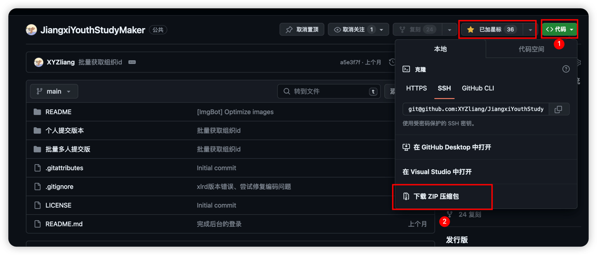

# JiangxiYouthStudyMaker

江西省2022、2023新版青年大学习善德教育系统自动提交大学习、自动导出未完成名单

## （新版本已经完成，最新大学习已经可用）

## 使用前提

对于只是想个人使用的，给自己或者就三四个人刷的，请使用 *个人提交版* ，无需抓包。

对于整个班级或者其他组织，想要给整个班级进行大学习或者只是快速导出未完成人员名单的，请使用 *批量多人提交版* 需要你**有大学习管理系统后台的账号密码**，不知道的话可以问上级组织。

## 运行环境

Python版本建议大于3.8，以下教程偏基础，如果你会Python，请跳跃着看，按自己情况配置即可。

没有安装环境的同学请按照教程[Python3.10安装教程（Windows）](https://blog.csdn.net/qq_47574956/article/details/130901233)、[Python3.10安装教程（MacOS）](https://blog.csdn.net/qq_18108159/article/details/130557770)进行安装。

Windows11系统可以按Win+R键，在输入框中输入cmd，点击确定，打开cmd（命令行窗口）,输入以下命令回车，等待系统一键安装完成即可。
```shell
winget install python3.10
```


## 配置指南

1. 将整个项目 Fork到自己仓库/拉取到本地/下载到本地并解压缩，也欢迎给项目点个Start~

    

2. <span id="terminal">跳转到的地方windows系统下按Win+R键，在输入框中输入cmd或者powershell，点击确定，打开终端；MacOS系统下打开实用工具中的终端。</span>

3. 输入以下命令回车（注意-r 后面有个空格）：

```shell
pip install -r 
```

3. 然后打开你要运行的版本（个人提交版和批量多人提交版）的文件夹，将文件夹下面的requirements.txt文件拖入终端，回车，等待系统一键安装完成即可。
   

   至此环境配置完成。

## 个人提交版本使用教程

个人提交版本 文件夹内文件如下：

```shell
.
├── requirements.txt         # 配置python环境所用的软件包
├── 个人提交.py               # 个人提交大学习的python脚本
```

打开江西共青团公众号的青年大学习H5页面，等待网页加载完毕（积分不是0就是加载好了），然后点击右上角分享按钮，选择复制链接。


随便粘贴到哪个地方，你会得到一串类似一下的信息：

```
http://www.jxqingtuan.cn/html/?accessToken=XXXXXXXXXXXXXXX&openid=XXXXXXXXXXXXXXX&requestType=http#/
```

accessToken= 到 & 或者 openid= 到 &之间的乱码XXXXXXXXXXXXXXX一样的就是我们所需要的openid，这是微信分配给开发者我们个人的一个id，把这个复制出来，粘贴到代码的第9行的引号之中：

```python
# 以下为所需的数据，注意引号别删了
# 必填 个人微信认证id，详见README
openId = "XXXXXXXXXXXXX"
```

强烈建议你自己在青年大学习H5页面的“我的”里填完整你的个人信息，确保后续你的提交会真实有效：

```python
# False为否，不强制提交 True为是，强制提交，即使个人信息不完整，也继续提交
force_submit = True
```

配置完毕，如果需要开始提交，[打开终端](#terminal)，输入(pyhton后面有个空格)：

```shell
python 
```

将 个人提交.py 文件拖入终端，回车，等待程序运行完成即可。


通过配置定时任务的方式可以实现自动大学习，详情请自己百度。

## 批量多人版本使用教程

敬请期待完成教程
