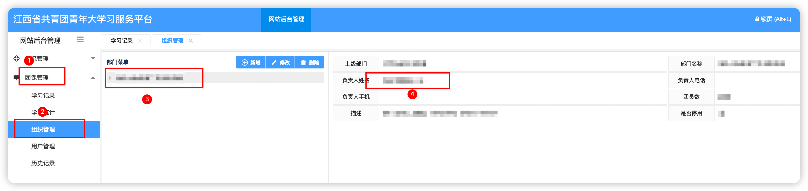
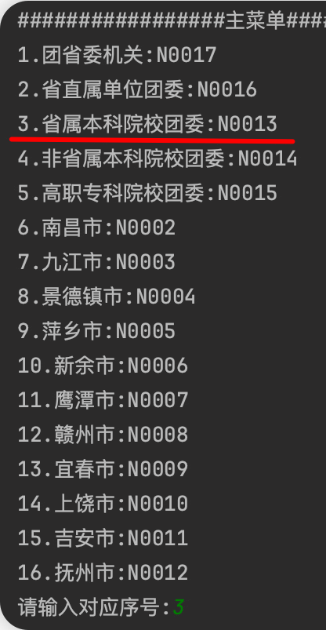
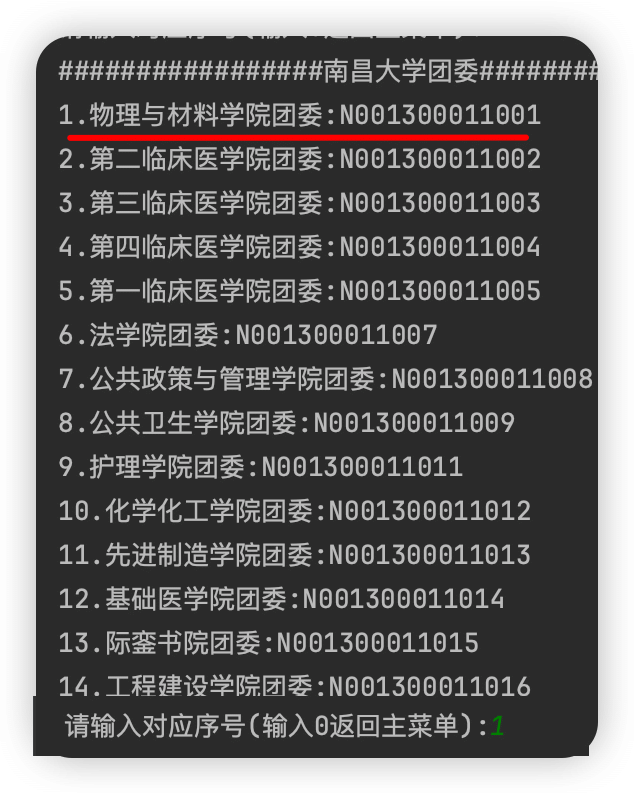
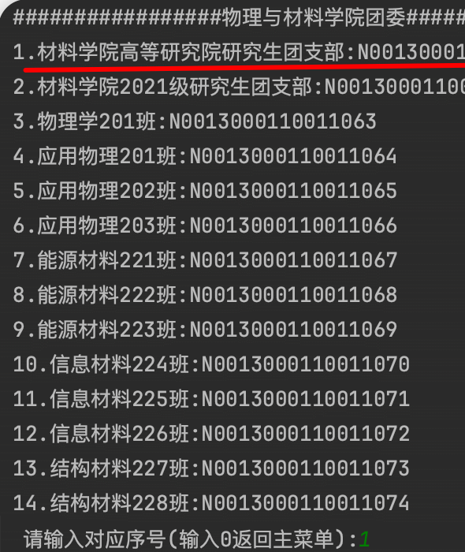
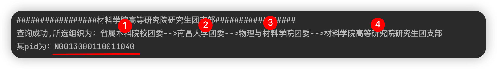

# [JiangxiYouthStudyMaker](https://github.com/XYZliang/JiangxiYouthStudyMaker)

江西省2022、2023新版青年大学习善德教育系统自动提交大学习、自动导出未完成名单

## （新版本已经完成，最新大学习已经可用）

## 使用前提

对于只是想个人使用的，给自己或者就三四个人刷的，请使用 *个人提交版* ，无需抓包。

对于整个班级或者其他组织，想要给整个班级进行大学习或者只是快速导出未完成人员名单的，请使用 *批量多人提交版* ，需要你**有大学习管理系统后台的账号密码**，不知道的话可以问上级组织。

## 运行环境

Python版本建议大于3.8，以下教程偏基础，如果你会Python，请跳跃着看，按自己情况配置即可。

没有安装环境的同学请按照教程[Python3.10安装教程（Windows）](https://blog.csdn.net/qq_47574956/article/details/130901233)、[Python3.10安装教程（MacOS）](https://blog.csdn.net/qq_18108159/article/details/130557770)进行安装。

Windows11系统可以按Win+R键，在输入框中输入cmd，点击确定，打开cmd（命令行窗口）,输入以下命令回车，等待系统一键安装完成即可。
```shell
winget install python3.10
```


## 配置指南

1. 将整个项目 Fork到自己仓库/拉取到本地/下载到本地并解压缩，也欢迎给项目点个Start~

    

2. <span id="terminal">windows系统下按Win+R键，在输入框中输入cmd或者powershell，点击确定，打开终端；MacOS系统下打开实用工具中的终端。</span>

3. 输入以下命令回车（注意-r 后面有个空格）：

```shell
pip install -r 
```

4. 然后打开你要运行的版本（个人提交版和批量多人提交版）的文件夹，将文件夹下面的requirements.txt文件拖入终端，回车，等待系统一键安装完成即可。
   

至此环境配置完成。

## 个人提交版本使用教程

个人提交版本 文件夹内文件如下：

```shell
.
├── requirements.txt         # 配置python环境所用的软件包
├── 个人提交.py               # 个人提交大学习的python脚本
```

 ### 准备过程：

1. 打开江西共青团公众号的青年大学习H5页面，等待网页加载完毕（积分不是0就是加载好了），然后点击右上角分享按钮，选择复制链接。

<div align=center></div>

2. 随便粘贴到哪个地方，你会得到一串类似一下的信息：

```
http://www.jxqingtuan.cn/html/?accessToken=XXXXXXXXXXXXXXX&openid=XXXXXXXXXXXXXXX&requestType=http#/
```

3. accessToken= 到 & 或者 openid= 到 &之间的乱码XXXXXXXXXXXXXXX一样的就是我们所需要的openid，这是微信分配给开发者我们个人的一个id，把这个复制出来，粘贴到代码的第9行的引号之中：

```python
# 以下为所需的数据，注意引号别删了
# 必填 个人微信认证id，详见README
openId = "XXXXXXXXXXXXX"
```

4. 强烈建议你自己在青年大学习H5页面的“我的”里填完整你的个人信息，确保后续你的提交会真实有效：

```python
# False为否，不强制提交 True为是，强制提交，即使个人信息不完整，也继续提交
force_submit = True
```

 ### 程序运行：

- <span id="runPY">配置完毕，如果需要开始提交，[打开终端](#terminal)，输入(pyhton后面有个空格)：</span>

  ```shell
  python 
  ```

- 将 个人提交.py 文件拖入终端，回车，等待程序运行完成即可。

  

- 通过配置定时任务的方式可以实现自动大学习，详情请自己百度。


## 批量多人版本使用教程

建议在使用前先查看一下个人提交版本的教程，无需操作，看一遍就行，熟悉一些流程和名词

<span id="about">批量多人提交版 文件夹内文件如下：</span>

```shell
.
├── config-template.ini       # 多人版本的模板配置文件，请根据下面教程完成配置后，修改名词为 config.ini 
├── requirements.txt          # 配置python环境所用的软件包
├── rsa                       # 登陆后台系统所需要的加密js脚本依赖
├── 历史学习数据                # 历史大学习的数据表格，由 批量获取历史数据.py 程序生成
├── 需要学习的名单              # 需要进行大学习的名单表格，需要人工放入，具体看下面教程
├── 未完成情况                  # 在配置文件中设置导出未完成名单后，运行 获取未完成人员并学习.py 程序会自动将没学习的名单生成并导出到这里面
├── 本期已学习情况              # 作用不大，仅用来保存临时测试数据，运行 获取未完成人员并学习.py 程序会自动生成
├── 自动学习情况                # 本次运行 获取未完成人员并学习.py 程序自动进行大学习的人员名单
├── 组织查询.py                # 查询组织的编号
├── 批量获取历史数据.py          # 获取历史大学习数据
└── 获取未完成人员并学习.py       # 获取未完成的人员，导出未完成名单，为未完成大学习的同学提交学习

```

 ### 准备过程：

1. 使用多人版，首选需要确认你自己的组织编号，可以通过以下方式：

   1.1  方式一：自行登陆进大学习后台，在 团课管理-组织管理-点击第一个你自己的组织名称 右侧就会出现当前组织的信息，负责人姓名一栏就是组织编号

   

   1.2  方式二：运行文件夹内的组织查询

   ​        运行 组织查询.py，运行方式可以[查看这里](#runPY)，将拖入的文件换为这个 组织查询.py

   ​        然后一层一层选自己的组织，忘记了的话，可以在大学习网页的“我的”里面的个人信息查看

   ​        举个例子，假设你是 省属本科院校团委-->南昌大学团委-->物理与材料学院团委-->材料学院高等研究院研究生团支部

   ​        那么依次选择：

   <div align=center></div>

   ​        那么你将得到类似以下的结果

   

   ​        N00开头的就是组织编号，将其复制到 config-template.ini (可以使用记事本、vscode打开) 中的nid那一栏：

   ​        

   ```ini
   [setting]
   # 所需查询/学习的组织id
   nid = N0013000110011040
   ```

   ​        **注意：**

   ​        **对于这种自身有三层上级组织的，我们称为四级组织。**

   ​        **目前代码应该只支持你本身是三级或者四级组织，给四级组织的人员进行操作，包括导出未完成名单和自动大学习**

   ​        **因为暂时没有一个纯三级组织的账户（下面没有子四级组织，三级组织就到底了）供我测试**

   ​        **如果你愿意提供，请提交issues并将你的大学习后台账号密码通过我主页的邮箱发给我**

   ​        在上面的示例中，材料学院高等研究院研究生团支部这个组织就是四级的，上面有省属本科院校团委、南昌大学团委、物理与材料学院团委这三层关系

   ​        代码仅支持你是物理与材料学院团委来给你学院下属所有团支部/班级的所有同学进行大学习

   ​        或者你是材料学院高等研究院研究生团支部给你这个团支部/班级的所有同学进行大学习

2. 完成组织编号的查询和填写后，请继续编辑config-template.ini，将信息填入，**填写完成后将 config-template.ini 重命名为 config.ini**。所有项目都有说明，已有值的建议不要修改

   ```ini
   # 批量多人提交版本配置
   # 在有自己组织后台管理账号的情况下，就可以进行查询、批量学习
   # 如果没有账号，请向上级组织请求，或者找我帮助
   
   [setting]
   # 所需查询/学习的组织id
   nid =
   # 从近多少期大学习中查询id
   limit = 10
   # 是否仅学习没学习的同学
   # 0为否，所有同学都会提交一遍，提交大学习时不需要后台账号
   # 1为是，仅学习没学习的同学，提交大学习时需要后台账号
   only_unlearned = 1
   # 导出未完成名单
   # 0为否，不导出 1为是，导出，需要only_unlearned = 1
   export_unlearned = 1
   # 每个操作之间的随机延迟时间，单位为秒，0为不延迟
   # 为了防止被系统检测到批量操作，并减小服务器压力，建议每个操作之间随机延迟一段时间
   # 例如：delay = 5, 则每个操作之间随机延迟0-5秒
   delay = 5
   # 最大重试次数
   # 有时候会出现网络问题，导致操作失败，这时候会自动重试，但是如果重试次数过多，大概率是系统崩了，建议稍后再试
   max_retry = 3
   # 强制提交
   # 0为否，不强制提交 1为是，强制提交，即使个人信息不完整，也继续提交
   force_submit = 1
   
   [management background]
   # 大学习管理后台账号
   username =
   # 大学习管理后台密码
   password =
   # 大学习管理后台登录地址
   # 系统后台很不稳定，现在有好几个网址，复制到浏览器看哪个能打开，然后写到下面的host中
   # mp.jxqingtuan.cn
   # 106.225.141.143:8103
   # 203.76.241.4:8103
   host = 106.225.141.143:8103
   # 系统后台的协议，如果不知道怎么看就http https来回尝试，一般为http
   protocol = http
   
   [encryptionKey]
   # 大学习管理后台加密密钥，如果你不知道这是什么，请不要修改，一般也不需要修改
   max_digits = 130
   public_exponent = 10001
   modulus = dff46645b6337855b0c1f9812a1a943904f2abd5f2f339f0f3b7f81cdb169eab00da0321a0075ef1d9e12d2af4d168b16d0f3ded064f8bcb97ca2af891eb73a0b55a2990b62fffc0cee0e61efcf5ec6247c8eb4a1f4df6d2ac42d930407c52c6e8cd07f6babf109c50428c3d8f1a64a66950178197136ee19b04b2bdf6dcb3df
   ```

   <span id="host">值得注意的是 host 这个配置，现在大学习后台很奇怪，似乎有两个系统，但又对应着多个给大家查询用的后台系统。在运行程序前，建议浏览器先看看 mp.jxqingtuan.cn 106.225.141.143:8103 203.76.241.4:8103这三个地址哪个能访问（这是我自己收集的可用后台链接，你如果有可以用自己的，也欢迎提issues发出来），将能访问的填入host</span>

   目前的规律是，白天大概率能进mp.jxqingtuan.cn，晚上大概率能进106.225.141.143:8103，当两个都不行的时候，203.76.241.4:8103又能用了.....

3. **第一次使用或者组织的成员有变动时**，需要先获取一下历史数据，目的是批量拿到上面个人提交版中的所有人的openid

   既然是历史数据，**就需要要求每个成员近期至少有学习过一次**，我们才能找到他的数据，拿到他的openid

   运行 批量获取历史数据.py，运行方式可以[查看这里](#runPY)，将拖入的文件换为这个 批量获取历史数据.py

   等待程序完成即可

   **获取一次历史数据之后，如果成员没变动，可以很长时间不用再获取，但依然建议大家半个学期左右运行一次，更新一下系统里大家的信息**
   
4. 将你组织人员的信息excel表放入 需要学习的名单 文件夹，excel表格内容不作很多限制，**只需要包含“姓名”、“团支部”即可**。特别注意的是，**“团支部”名称可能和你认识的名称是不同的，取决于系统里叫什么**，请自己去大学习后台的团课管理-组织管理 里查看自己组织或者子组织的团支部名称，或者在运行 批量获取历史数据.py 后，历史数据文件夹下的excel名字就是子组织各自的名称，请直接重命名复制粘贴（部分团支部甚至名字前面有空格）。
   
   团支部名称一定要对得上，后面在刷大学习时也会进行检查

 ### 程序运行：

- 确保准备过程的相关工作都完成后，直接运行 获取未完成人员并学习.py 即可，运行步骤[同上面](#runPy)，相关数据会各自导入相关文件夹，详情查看[这里](#about)

 ### 注意

- 如果出现报错，在确保配置无误（后台账号密码）的情况下，**先[检查配置的host网址](#host)是否能正常访问**，如果不能访问修改相关配置

- 确保运行批量 获取历史数据.py、获取未完成人员并学习.py 的时候**避开每个小时的00~05分、30~35分**，这段时间内后台系统在统计新的完成记录（每半小时刷新），此时运行因为要查询本期/往期的学习情况，后台会卡死没有数据，因此避开这些时间

- 目前大学习系统还处于一个经常修改的状态，数据也很矛盾，因此可能需要我对程序进行更新，也很大概率是系统崩溃了，**建议过段时间在白天再次尝试**，还是有问题的话，带上完整的程序输出，提交issues

## 免责声明

1. 本程序为免费开源项目，仅供交流学习，遵循GPL v3开源协议，无任何形式的盈利行为。
2. 本程序服务于原系统，旨在让原系统功能更强大。
3. 本程序皆调用官方接口实现，无任何“Hack”行为，无破坏官方接口行为。
4. 本程序仅做数据处理，不拦截、存储、篡改任何用户数据。
5. 严禁使用本程序进行盈利、散播任何违法信息等行为。
6. 本程序不作任何稳定性的承诺，如因使用本程序导致的问题，均与本程序无关。

 
