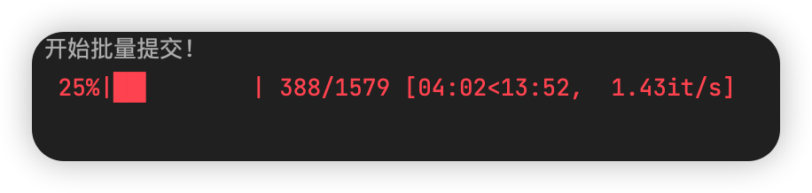

# JiangxiYouthStudyMakersPlus
 江西省2022新版青年大学习善德教育系统自动大学习多人批量提交版

## 运行环境

Python3，requests，**xlrd==1.2.0**，tqdm

## 手动运行指南

1. 确保你已了解普通单人版如何使用

2. 在Data.xlsx写入多人的数据

3. 在makers.py内10-13行进行简单配置，详见备注

   

   

   

   ## 免责声明

   1. 此新系统还在开发当中，此脚本有随时失效的风险。如失效请提交issue，我会尽快修复
   2. 本程序为免费开源项目，仅供交流学习，遵循GPL v3开源协议，无任何形式的盈利行为。
   3. 本程序服务于原系统，旨在让原系统功能更强大。
   4. 本程序皆调用官方接口实现，无任何“Hack”行为，无破坏官方接口行为。
   5. 本程序仅做数据处理，不拦截、存储、篡改任何用户数据。
   6. 严禁使用本程序进行盈利、散播任何违法信息等行为。
   7. 本程序不作任何稳定性的承诺，如因使用本程序导致的问题，均与本软件无关。

